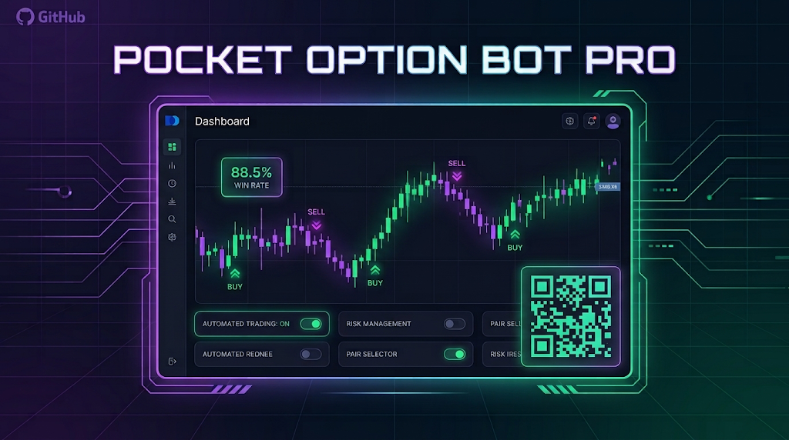

  

🇬🇧 [English](README.md) | 🇩🇪 [Deutsch](README.de.md) | 🇬🇷 [Ελληνικά](README.el.md) | 🇫🇷 Français | 🇮🇹 [Italiano](README.it.md) | 🇲🇾 [Bahasa Melayu](README.ms.md) | 🇵🇱 [Polski](README.pl.md) | 🇵🇹 [Português](README.pt.md) | 🇻🇳 [Tiếng Việt](README.vi.md) | 🇹🇭 [ไทย](README.th.md) | 🇰🇷 [한국어](README.ko.md) | 🇯🇵 [日本語](README.ja.md) | 🇷🇺 [Русский](README.ru.md) | 🇪🇸 [Español](README.es.md) | 🇮🇩 [Bahasa Indonesia](README.id.md) | 🇸🇦 [العربية](README.ar.md)

# Pocket Option Bot PRO

Bot de trading automatisé pour la plateforme [Pocket Option](https://pocketoption.com), distribué ici sous forme de builds prêts à installer — sans attendre la validation du Chrome Web Store, et chaque version précédente reste disponible.

- Site web: https://2bot.top/fr/
- Telegram (chaîne d'actualités): https://t.me/PO_bot_news
- YouTube: https://www.youtube.com/@PocketOptionRobot
- Chrome Web Store: https://chromewebstore.google.com/detail/pocket-option-bot-pro/fgpcopnjkdcheolcfjlkcfifiphpakla

Une suggestion ou un problème à signaler ? Laissez-le sur la [page de contact de 2bot.top](https://2bot.top/fr/contact/).

Ce dépôt publie des versions prêtes à installer de l'extension, ce qui vous permet d'installer les nouvelles versions avant qu'elles ne passent la validation du Chrome Web Store, et de toujours télécharger une version antérieure si vous devez revenir en arrière. Consultez [CHANGELOG.md](CHANGELOG.md).

## Exemples vidéo du fonctionnement des stratégies

|  |  |  |  |  |
|:---:|:---:|:---:|:---:|:---:|
| [stratégie "none"](https://youtu.be/RYci6-vpeNQ) | [Stratégie RSI](https://youtu.be/rpceGtEW_9U) | [Stratégie MACD](https://youtu.be/gqMDqFxTA-U) | [Stratégie stochastique](https://youtu.be/eW3je_L8W3s) | [Stratégie de séquence de bougies](https://youtu.be/ukDODbFWKFY) |

## Installation (manuelle, mode développeur)

Chrome bloque l'installation directe des fichiers `.crx` en dehors du Chrome Web Store. La seule façon d'installer une version depuis ce dépôt est donc de la charger comme **extension non empaquetée (unpacked)** en mode développeur :

1. Rendez-vous sur la page [Releases](../../releases) et téléchargez le `.zip` de la version souhaitée (la première est marquée **Latest**).
2. Décompressez-le dans un dossier que vous comptez conserver sur le disque — ne supprimez pas ce dossier par la suite, Chrome charge l'extension depuis celui-ci à chaque démarrage du navigateur.
3. Ouvrez `chrome://extensions` dans Chrome (ou tout navigateur basé sur Chromium).
4. Activez le **mode développeur** (interrupteur en haut à droite).
5. Cliquez sur **Charger l'extension non empaquetée (Load unpacked)** et sélectionnez le dossier décompressé à l'étape 2.
6. L'extension apparaît dans votre liste d'extensions et s'active automatiquement sur pocketoption.com et ses miroirs officiels.

### Mise à jour vers une nouvelle version

Les extensions non empaquetées installées de cette façon **ne** se mettent **pas** à jour automatiquement. Pour mettre à jour :

1. Téléchargez et décompressez le `.zip` de la nouvelle version depuis [Releases](../../releases) dans un **nouveau** dossier (ou remplacez l'ancien).
2. Si vous avez remplacé le même dossier : ouvrez `chrome://extensions` et cliquez sur l'icône de rechargement (↻) sur la carte de l'extension.
3. Si vous avez utilisé un nouveau dossier : supprimez l'ancienne entrée de l'extension dans `chrome://extensions` et cliquez de nouveau sur **Charger l'extension non empaquetée** depuis le nouveau dossier.

### Revenir à une version précédente

Chaque version publiée reste disponible sur la page [Releases](../../releases) — téléchargez le `.zip` de la version dont vous avez besoin et installez-la de la même façon.

## Avertissement

Le trading d'options binaires comporte un risque élevé de perte. Cette extension est un outil d'automatisation qui suit les règles que vous configurez — elle ne constitue pas un conseil financier et ne garantit aucun profit. Vous êtes seul responsable de vos décisions de trading.
